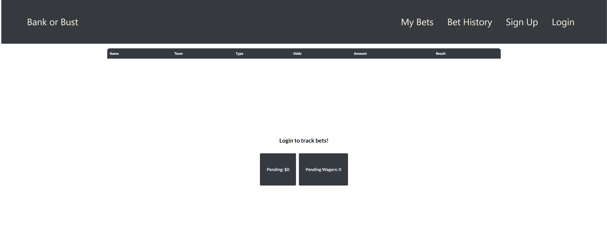

# Bank or Bust

Bank or Bust is a simplistic app for sports bettors to track bets and see how much they are winning or losing! Visit [Bank or Bust](https://bank-or-bust98.herokuapp.com/) to start tracking your bets.

## Wireframes 

## Technologies Used:

- Node.js
- MongoDB
- React
- Express
- Mongoose
- HTML
- CSS
- Bootstrap

## Getting Started 

[Visit my App](https://bank-or-bust98.herokuapp.com/)

[See my Trello Board](https://trello.com/b/izoHZMC3/bank-or-bust)

## Next Steps

1. Implement Odds api for live odds of current match ups 
2. add public chat room to app that will alow all users to communicate about bets
